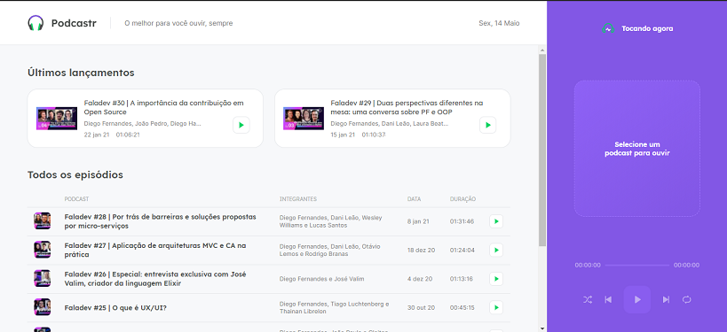
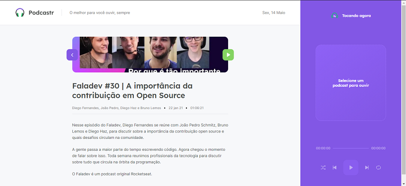
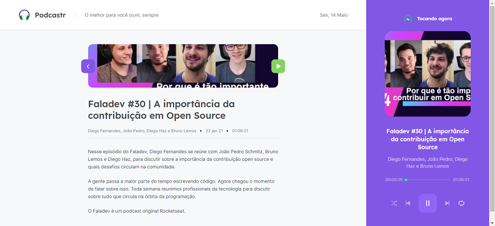

# Podcastr
Projeto desenvolvido na quinta edição da Next Level Week da [RocketSeat](https://rocketseat.com.br/).

Este é um projeto [Next.js](https://nextjs.org) inicializado com [`create-next-app`](https://github.com/vercel/next.js/tree/canary/packages/create-next-app).

O Podcastr é um aplicativo para ouvir podcasts feito em React. Ele usa conceitos de SSR (*Static Site Generation*) e SSR (*Server Side Rendering*). 

# Instruções
Depois de obter o projeto no seu computador, abra uma janela de linha de comandos e acesse o diretório raíz do projeto.

Este aplicativo faz requisições para uma API de dados sobre podcasts construída com o auxílio do JSON Server. Se ainda não tem o JSON Server no seu computador, instale-o globalmente:
```bash
yarn add global json-server
```

Em seguida, inicie o json-server:
```bash
yarn server
```

**Obs:** O script `server` está definido dentro de `package.json` para iniciar o JSON Server.

Em outra janela de linha de comandos, dentro do diretório do projeto, instale as dependências e execute o servidor de desenvolvimento:
```bash
yarn
yarn dev
```

Com o seu navegador da Web, abra a URL [http://localhost:3000](http://localhost:3000) para ver o resultado.

## Principais bibliotecas e dependências de projeto
- React
- Next.js
- TypeScript
- SASS
- Axios
- Date FNS

## Screenshots




